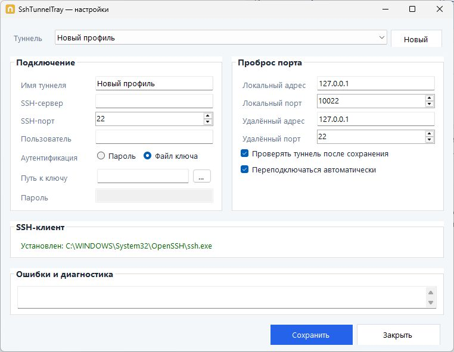

# SshTunnelTray

Небольшая Windows-утилита для управления SSH-туннелями из системного трея.



> В репозитории хранится исходный код и безопасные примеры. Рабочая конфигурация, приватные ключи, пароли, логи и результаты сборки намеренно исключены.

## Возможности

- несколько именованных профилей SSH-туннелей;
- запуск, остановка и переподключение из системного трея;
- проверка, что локальный порт проброса действительно поднят;
- аутентификация приватным ключом или SSH-паролем;
- выбор `ssh.exe` и ссылка на официальный Win32-OpenSSH;
- проверка host key стандартным OpenSSH через системный `known_hosts`;
- компактное окно настроек и состояние туннеля через цвет иконки.

## Требования

- Windows 10/11 x64;
- .NET 10 Desktop Runtime x64 для запуска обычной сборки;
- `ssh.exe` из Windows OpenSSH или Win32-OpenSSH.

Путь к SSH-клиенту можно оставить пустым: приложение попробует найти `ssh.exe` в `PATH`. Для скачивания используется официальный раздел [Win32-OpenSSH Releases](https://github.com/PowerShell/Win32-OpenSSH/releases).

## Запуск из исходников

```powershell
dotnet restore --runtime win-x64
dotnet run --project .\SshTunnelTray.csproj
```

Запуск конкретного профиля:

```powershell
SshTunnelTray.exe -t "Имя профиля"
```

Без параметров приложение открывает настройки. Профиль создается только после заполнения обязательных полей: SSH-сервера, порта и логина.

## Сборка и публикация

```powershell
dotnet restore --runtime win-x64
dotnet publish .\SshTunnelTray.csproj `
  --configuration Release `
  --runtime win-x64 `
  --self-contained false `
  -p:PublishSingleFile=true `
  -o .\publish
```

Каталог `publish/` игнорируется Git и не должен добавляться в коммит. Релизный EXE лучше собирать в CI или прикладывать к GitHub Release отдельно от исходного кода.

## Где хранится локальная конфигурация

При работе приложение создает рядом с исполняемым файлом:

- `SshTunnelTray.json` — профили, пути к ключам, параметры проброса и настройки SSH;
- `<имя-профиля>.cmd` — сгенерированный launcher для запуска профиля.

Эти файлы могут содержать реальные адреса, логины, локальные пути и зашифрованные пароли. Они исключены правилами `.gitignore` и проверяются скриптом `scripts/Verify-Public.ps1`. Не используйте `git add -f` для их добавления.

Безопасный шаблон находится в [samples/SshTunnelTray.json.example](samples/SshTunnelTray.json.example). Он не предназначен для публикации реальных значений.

Важно: шифрование пароля в локальном JSON не делает этот JSON публичным или безопасным для GitHub. Приватный ключ остается за пределами репозитория; в профиле хранится только путь к нему.

## Структура проекта

```text
SshTunnelTray/
├── App/                 # запуск, tray-контекст и launcher профилей
├── Config/              # JSON-конфигурация и локальные секреты
├── Domain/              # модели профилей и состояния
├── Runtime/             # запуск ssh.exe и контроль туннеля
├── Tray/                # иконка и состояние трея
├── UI/                  # окно настроек WinForms
├── docs/                # документация и безопасные скриншоты
├── samples/             # только обезличенные примеры
├── scripts/             # проверки перед публикацией
└── .github/             # CI, шаблоны issue и pull request
```

## Проверка перед GitHub

Перед первым коммитом выполните:

```powershell
pwsh -NoProfile -File .\scripts\Verify-Public.ps1
```

После создания Git-репозитория проверяйте именно индекс:

```powershell
pwsh -NoProfile -File .\scripts\Verify-Public.ps1 -TrackedOnly
```

Подробный порядок публикации находится в [docs/PUBLICATION-CHECKLIST.md](docs/PUBLICATION-CHECKLIST.md). Для коммитов можно включить локальный hook-шаблон:

```powershell
git config core.hooksPath .githooks
```

На стороне GitHub дополнительно включите secret scanning и push protection. Эти функции помогают блокировать поддерживаемые секреты до попадания в публичный репозиторий, но не заменяют проверку файлов и ротацию уже раскрытых ключей.

## Безопасность и сообщения об ошибках

Правила обращения с конфигурацией и порядок сообщения о потенциальной утечке описаны в [SECURITY.md](SECURITY.md). Не прикладывайте к issue или pull request реальные JSON, логи, скриншоты с адресами и приватные ключи.

## Лицензия

Файл лицензии пока не выбран. До публичного релиза нужно отдельно выбрать лицензию проекта: наличие репозитория на GitHub само по себе не дает права переиспользовать код.
